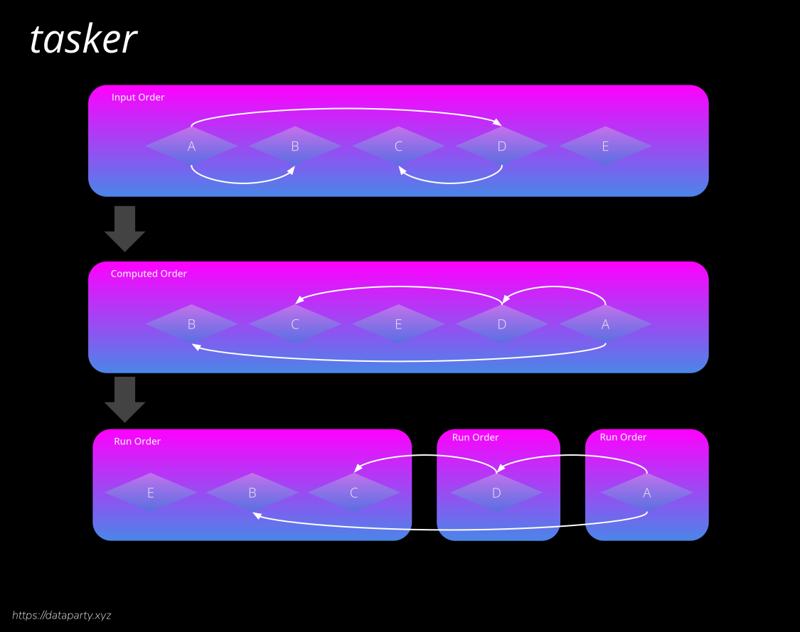

# Tasker
[](https://github.com/badges/stability-badges)[](https://github.com/datapartyjs/tasker/blob/main/LICENSE)

Tasker is a parallel task runner with dependency resolution and results collection.

# Design

Tasker provides a [`Runner`](https://datapartyjs.github.io/tasker/Runner.html) class which manages depedencies, tasks and results. The runner class utilizes the [dependency-solver](https://www.npmjs.com/package/dependency-solver) npm package. When possible upto [`Runner.parallel`](https://datapartyjs.github.io/tasker/Runner.html#Runner) foreground tasks will be run at the same time. When background tasks are added to the `Runner` they are started immeditaly and do not count against the parallel limit. 



Consumers of the library are expected to extend the [`Task`](https://datapartyjs.github.io/tasker/Task.html) class to later instantiate and add instances to a runner. Tasks are added by calling [`Runner.addTask(myTaskInstance)`](https://datapartyjs.github.io/tasker/Runner.html#addTask).

For more details see documentation:

* [`class Runner`](https://datapartyjs.github.io/tasker/Runner.html)

* [`class Task`]((https://datapartyjs.github.io/tasker/Task.html))


## Foreground Tasks

By default tasks are in the foreground. Tasks can be defined either with a function or by subclassing. See a [complete tutorial](https://datapartyjs.github.io/tasker/tutorial-foreground%20tasks.html).

### Define task using function

```
let sleepThirty = async ()=>{
  return new Promise((resolve,reject)=>{
    setTimeout(resolve, 30*1000)
  })
}

let myTask = Tasker.Task({
  name: 'sleep-30',
  exec: sleepThirty
})

runner.addTask(myTask)
```

### Define task with subclass

```
class SleepTask extends Tasker.Task {
  constructor(durationMs){
    this.duration = durationMs
    this.timeout = null
  }

  async exec(){
    return new Promise((resolve,reject)=>{

        this.timeout = setTimeout(this.onTimeout.bind(this), 30*1000)

      })
    }
  }

  onTimeout(){
    this.timeout = null
    console.log('sleep complete')
  }

  stop(){
    if(this.timeout !== null){
      clearTimeout(this.timeout)
      this.timeout = null
    }
  }
}


let sleepThirty = new SleepTaks(30*1000)

runner.addTask(sleepThirty)
runner.start()
```

## Background Tasks

Background tasks do not count against the parallel task limit. On failure background tasks are restarted immediatly and will be kept running indefinitly. Background tasks only ever stop if they are explicitly cancelled.

### How to implement a background task

 * You must set the constructor property [`Task.background`](https://datapartyjs.github.io/tasker/Task.html#constructor) to true during task construction.
 * You must implement a [`Task.exec()`](https://datapartyjs.github.io/tasker/Task.html#exec) function which returns [`Task.detach()`](https://datapartyjs.github.io/tasker/Task.html#detach)
 * You must implement a [`Task.stop()`](https://datapartyjs.github.io/tasker/Task.html#stop) function which stops your tasks.
 * Call [`Task.backgroundResolve(value)`](https://datapartyjs.github.io/tasker/Task.html#backgroundResolve) when stopping successfully or due to a call to `Task.stop()`.
 * Call [`Task.backgroundReject(value)`](https://datapartyjs.github.io/tasker/Task.html#backgroundReject) when stopping due to failure.